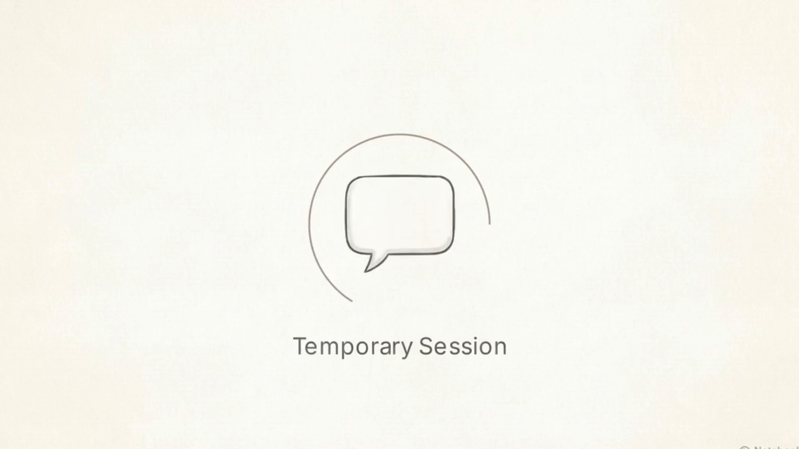
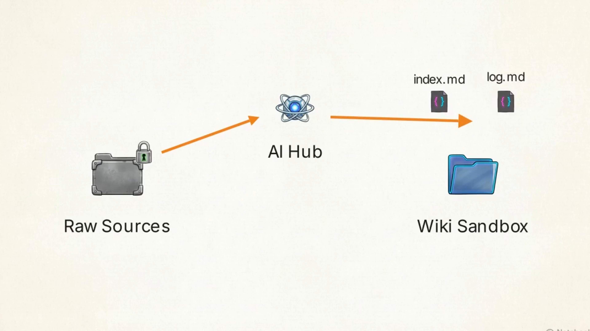

# Build an LLM Wiki

**Channel:** Notalentart  
**URL:** https://youtu.be/aGXTV5MTqDY  
**Duration:** 00:05:22

---

## Chapters

### 1. The Problem with Temporary AI Chat Sessions `[00:00:00]`

The video highlights the inefficiency of traditional AI chat interfaces where carefully built context is lost after each session, forcing the AI to restart from scratch for complex problems. It proposes building an 'LLM Wiki' as a solution that acts as a persistent bookkeeper for your knowledge.

### 2. Setting Up the LLM Wiki Directory `[00:00:20]`

The first step involves creating a master folder with two subfolders: 'Raw Sources' (for original PDFs, images, articles, which are read-only for the AI) and 'Wiki'. A `schema.md` configuration file, placed in the root directory, establishes strict rules for directory structure, naming conventions, and file formatting, effectively turning a generic AI into a disciplined archivist.

### 3. AI Navigation and Data Ingestion `[00:02:26]`

Inside the 'Wiki' subfolder, two blank text files, `index.md` and `log.md`, are created. The `log.md` uses a specific Unix-style date format for easy parsing of actions. The `schema.md` provides explicit rules, creating a safe sandbox for the AI to operate. The ingestion workflow demonstrates how dropping a document into 'Raw Sources' prompts the AI to read, summarize, cross-reference, and log the entry.

### 4. Querying, Linking, and Database Maintenance `[00:05:10]`

After ingesting sources, users can prompt the AI with specific questions, forcing it to compare new documents against existing wiki topics and save the synthesis as a new, linked permanent page. This process visually connects previously isolated summaries in a graph, increasing the database's value. To maintain organization, a monthly 'lint pass' prompts the AI to perform a health check, fixing broken links, duplicate tags, and organizational gaps autonomously.
